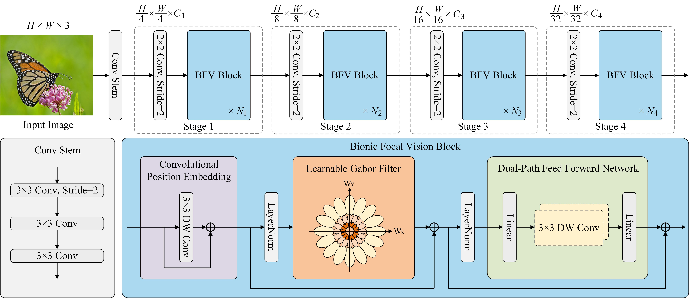

# FViT: A Focal Vision Transformer with Gabor Filter

[](https://opensource.org/licenses/Apache-2.0) 
<a href="https://pytorch.org/get-started/locally/"></a>

This is the official PyTorch implementation of FViT. It is worth noting that the latest manuscript is still under review.

Inspired by biological vision, the potential advantages of integrating vision transformers with classical image processing algorithms are reexamined, and an effective Learnable Gabor Filter (LGF) based on depthwise convolution is proposed. As an alternative to the self-attention mechanism, LGF demonstrates high efficiency and scalability. In addition, drawing inspiration from neuroscience, a Dual-Path Feed-Forward Network (DPFFN) is introduced to emulate the parallel and cascaded information processing scheme of the biological visual cortex. Based on LGF and DPFFN, a Bionic Focal Vision (BFV) block is proposed as the basic building block. Furthermore, following the hierarchical design concept, a unified and efficient family of pyramid backbone networks called Focal Vision Transformers (FViTs) is developed by stacking BFV blocks. The FViTs comprise four variants, namely, FViT-Tiny, FViT-Small, FViT-Base and FViT-Large. These variants are designed to enhance the applicability of FViTs for various computer vision tasks.

The overall pipeline of FViT is illustrated in this figure.




## Installation

### Requirements

- Linux with Python ≥ 3.6
- PyTorch >= 1.8.1
- timm >= 0.3.2
- CUDA 11.1
- NVIDIA GPUs

### Conda environment setup

```bash
conda create -n FViT python=3.9
conda activate FViT

# Install Pytorch and TorchVision
pip install torch==2.3.1 torchvision==0.18.1 torchaudio==2.3.1 --index-url https://download.pytorch.org/whl/cu121

pip install timm
pip install ninja
pip install tensorboard

# Install NVIDIA apex
git clone https://github.com/NVIDIA/apex
cd apex
pip install -v --disable-pip-version-check --no-cache-dir --global-option="--cpp_ext" --global-option="--cuda_ext" ./
cd ../
rm -rf apex/

# Build other environments
pip install opencv-python==4.4.0.46 termcolor==1.1.0 yacs==0.1.8
```

## Model Zoo

- The FViTs are trained for multiple runs, and we report the averaged results, while the best-performing checkpoints can be downloaded here.

| Method     | Size | Acc@1 | #Params (M) | Download                                                                                                                                                                          |
|------------|:----:|:-----:|:-----------:|-----------------------------------------------------------------------------------------------------------------------------------------------------------------------------------|
| FViT_Tiny  |  224 | 79.1  |    11.9     | 47M [[Google]](https://drive.google.com/file/d/1AQHQESqt-R-dyy37NuoioCssT6EcVIkO/view?usp=drive_link) [[BaiduNetdisk]](https://pan.baidu.com/s/12U-fzeRdVwSdp7vCfDzWRg?pwd=pefe)  |
| FViT_Small |  224 | 82.3  |    24.8     | 99M [[Google]](https://drive.google.com/file/d/16ktji4FBRawXqFWJRcyrqK_awHwCmGvR/view?usp=drive_link) [[BaiduNetdisk]](https://pan.baidu.com/s/1JBjBpzJU1WPhxMjEPLElPw?pwd=wtaz)  |
| FViT_Base  |  224 | 83.4  |    42.7     | 171M [[Google]](https://drive.google.com/file/d/1jDw3rdMMXbU8QIqXB-Qoa7FSYBUguWHn/view?usp=drive_link) [[BaiduNetdisk]](https://pan.baidu.com/s/1kyHci-TsTlDUnYzo4w2phA?pwd=b2ma) |
| FViT_Large |  224 | 83.8  |    61.5     | 246M [[Google]](https://drive.google.com/file/d/1ew7VznMIFlsDVwmxQoKqCJc0Fuzrr_4z/view?usp=drive_link) [[BaiduNetdisk]](https://pan.baidu.com/s/17CSVzzS7m4SmEgqHOJ-6GQ?pwd=gsvf) |

## Evaluation
To evaluate a pre-trained FViT-Base on ImageNet val with GPUs run:
```
python -m torch.distributed.run --nproc_per_node=8 --master_port 18875 train.py --eval True --model FViT_Base --datasets_path /home/ubuntu/Datasets/ImageNet --resume /home/ubuntu/Datasets/FViT-main/save_path/FViT_Base.pth
```

If you use this code in your work, please cite this paper, which is part of our parallel study. The link to FViT will be made publicly available once the manuscript is accepted.

```
@article{shi2025evit,
  title={Evit: An eagle vision transformer with bi-fovea self-attention},
  author={Shi, Yulong and Sun, Mingwei and Wang, Yongshuai and Ma, Jiahao and Chen, Zengqiang},
  journal={IEEE Transactions on Cybernetics},
  year={2025},
  volume={55},
  number={3},
  pages={1288-1300},
  publisher={IEEE}
}
```
