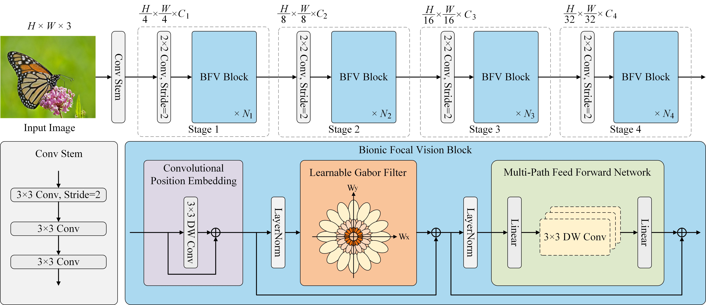

# FViT: A Focal Vision Transformer with Gabor Filter

The code will be released at this repository after the paper [FViTs](https://arxiv.org/abs/2402.11303) is accepted by journals.

This repository will contain the PyTorch training and evaluation code for [FViTs](https://arxiv.org/abs/2402.11303).

The overall pipeline of EViTs is illustrated in this figure.



If you use this code for a paper please cite:

```
@article{shi2024fvit,
  title={FViT: A Focal Vision Transformer with Gabor Filter},
  author={Shi, Yulong and Sun, Mingwei and Wang, Yongshuai and Wang, Rui and Sun, Hui and Chen, Zengqiang},
  journal={arXiv preprint arXiv:2402.11303},
  year={2024}
}
```

